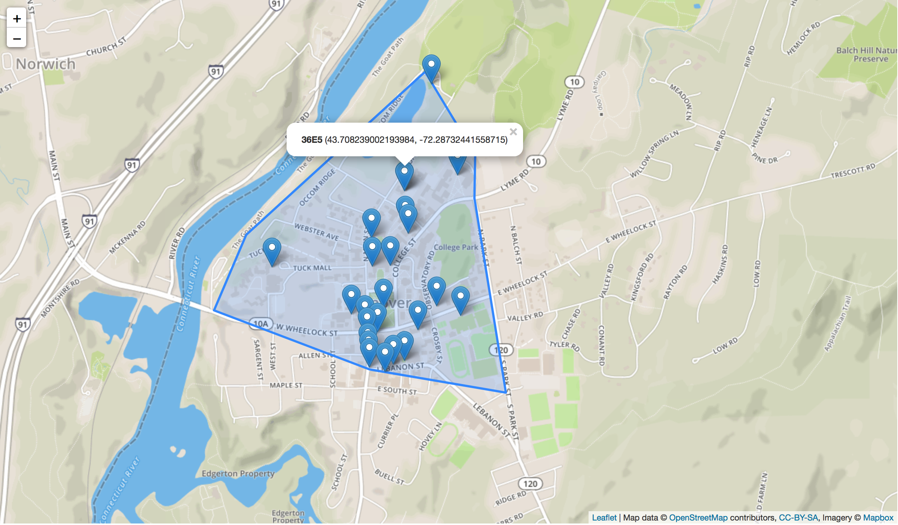
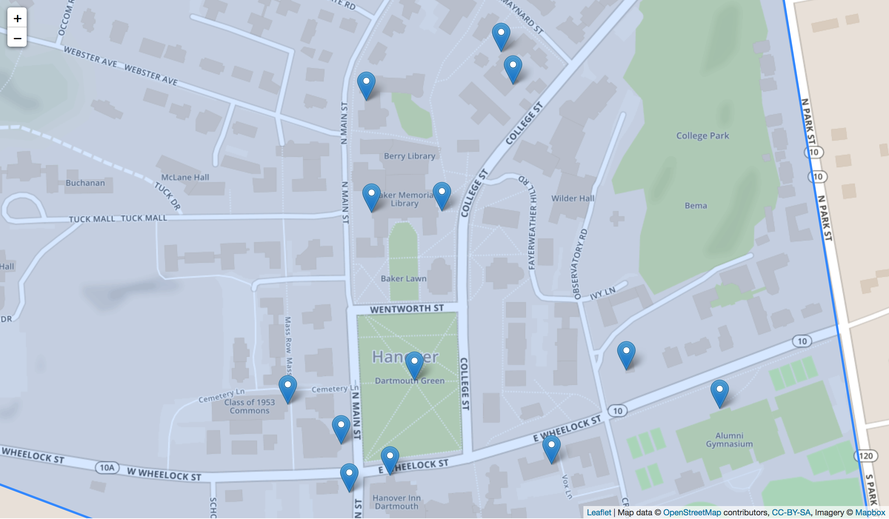

# Code Drop Helper

A geolocation module for creating "code drops" (codes associated with geographic coordinates).
This tool was created to aid CS 50 students at Dartmouth in their design and implementation of the final project:
    [***Mission Incomputable***](https://traviswp.github.io/classes/pebble-project-intro/specs-2016/).
See the above link for more information on the game itself.

As part of the game,
    teams work together to locate a collection of "code drops" while avoiding capture by other teams.

> A *code drop* is a piece of paper, posted in a public space, with a 4-digit hex code printed on the paper.
> A code drop is *neutralized* when the field agent is close enough to read the code and correctly enter that code
> on her Pebble screen. Once a code drop has been neutralized, no other team can find it.

> ...

> The game ends when all code drops have been found; or, OPTIONALLY,
> when the terminal user provides input to end the game early.

Thus, to help students create code drops for gameplay, we designed this module.
The module primarily consists of two parts:
    (1) a Pebble application (see: `src/`) that allows a person to mark their current location and
    generate a random 4-digit hex code, and
    (2) a "filewriter" (see: `filewriter/`) which uses a `codedrop.dat` file to render a visual map
    of the locations of all of the code drops.

# How It Works

In the following text I'll briefly describe how the client and server components
    work together to help students create code drops.

### The Server

First, start the `filewriter` server on a publicly-addressable machine.
Students in CS 50 tend to use [`flume`](http://www.cs.dartmouth.edu/~wbc/dept_welcome.html),
    one of the servers hosted in our department.
Indeed, if you deviate from using `flume`, you'll need to update
    [`appinfo.json`](https://github.com/traviswp/code-drop-helper/blob/master/appinfo.json) -
    near the bottom of the file:

```
"serverURL": "flume.cs.dartmouth.edu",
"serverPort": 45454
```

This configuration information is essential as it informs the client application
    about how to reach the correct server.

The easiest way to run the `filewriter` server is to navigate into the `filewriter/`
    directory and run:

```
make file
```

which starts the `filewriter` server (implemented as a NodeJS server).

The `filewriter` basically just sits and waits for websocket connections.
When a connection is made from a client, the server logs any data messages
    (i.e., geographic coordinates & corresponding hex code) into a single `.dat` file for that session.)
If the client disconnects and later reconnects,
    the server will happily accept subsequent connections;
    as a result, you may need to combine a collection of `.dat` files to
    compose your complete code drop file.

Here is a snippet from one of my sample `codedrop.dat` files:

```
43.7050831248106, -72.29492692556658, 68A6
43.70889161906508, -72.28428544564693, B3EB
43.70647161906508, -72.28710544564693, 2CA3
43.70514073366537, -72.28813980827107, 9231
...snip...
```

### The Client

Next, install the `code-drop-helper` application on a Pebble that is paired with a smartphone.
(see [*Getting Started with Pebble*](https://traviswp.github.io/classes/pebble-project-intro/index.html)
for a refresher on how to setup your machine for Pebble development and how to install Pebble applications)
Now, with the `code-drop-helper` application open on the Pebble, and the Pebble app open on your smartphone,
    walk to a desired location.
The UI on the pebble will show you which button to push.
Upon pushing the button, your Pebble will generated a random hex code and send it via Bluetooth to the
    connected smartphone.
The smartphone will then get its current GPS coordinates and send them (along with the hex code)
    along to the server.

*Because the Pebble and smartphone work in tandem to generate data and send it to the server,
    it is essential that you have your smartphone in proximity to the Pebble and have a good signal.*


**Potential issues and troubleshooting:**

I'll note that in my testing, I had the best results with this tool when I was not on a Wi-Fi connection,
    but rather on a cellular connection.
When switching onto/off of Wi-Fi networks, I sometimes encountered an issue with the
    Pebble/smartphone dropping the connection to the server and then being unable to reconnect.
The websocket capabilities weren't very mature at the time that I originally composed this tool;
    my implementation includes a "reconnecting websocket" which tries to handle these issues gracefully,
    but alas, it isn't perfect.
If you get stuck, restart the app on the Pebble/smartphone and it should reconnect.
Note that the Pebble UI will report on the status of the connections to the smartphone and the server
    (it should go without saying that if the Pebble is disconnected from the smartphone,
        it is also disconnected from the server).

For the most part, GPS performs poorly when you are indoor anyways (unless you are near a window perhaps).
Thus, go outside and ensure that your smartphone is not connected to Wi-Fi.
Then start the apps.

### Post-processing

Once you are happy with all of the code drop information you've collected,
    return to the server where the `filewriter` is running.
The `Makefile` includes other targets that help you, e.g.,
    compile a collection of `.dat` files to make a complete `codedrop.dat` file, and
    create a visual map based on a `codedrop.dat` file.

For example, I walked around campus, recorded some code drops, and generated the
    following map for demonstration purposes.





A couple of things to note:

**Creating your own map:**

You don't need to worry about styling and creating the map for your code drop files.
By running `make dat; make map`, I'll aggregate all of your `*.dat` files into a single
    `codedrop.dat` file and then the `makemap.js` file will use a template
    which I've created for you and pull in your `codedrop.dat` data.

**Interacting with a map:**

Once generated, you'll notice that you can hover over the different markers
    and see the bolded, 4-digit hex code as well as the latitude and longitude of the code drop.
All of this data is pulled from the `codrdrop.dat` file and rendered in the map for you.

**Using my example files:**

For my data file and the complete HTML page, see
    [`filewriter/cs50example/`](https://github.com/traviswp/code-drop-helper/tree/master/filewriter/cs50example).
Feel free to use this example file for testing.
(In an actual game, there are physical pieces of paper that posses the hex codes needed to
    neutralize a code drop---these will be prepared by TAs and released later).

**Map not rendering?:**

The map visualization is based on the [Leaflet](http://leafletjs.com/)
    javascript library for composing interactive maps.
It also requires an access token from [mapbox](https://www.mapbox.com/).
If the makers show up but you don't see the underlying map,
    it might be an access token issue.
I've included my personal access token in my example files but if it expires,
    you may need to go to mapbox, get an access token (its free and easy) and plug it into `header.txt`
    (just search for "accessToken" in the file).

# Directory Layout

```
$ tree .
.
|-- README.md
|-- appinfo.json             #<<< Shared configuration info - recompile and restart server/client apps to ensure consistency
|-- filewriter               #<<< Server code
|   |-- Makefile
|   |-- cs50example
|   |   |-- codedrop.dat
|   |   `-- map.html
|   |-- filewriter
|   |-- footer.txt
|   |-- header.txt
|   |-- makemap.js
|   |-- map-example.html
|   `-- package.json
|-- src                       #<<< Client code
|   |-- code-drop-helper.c
|   |-- code.h
|   |-- js
|   |   `-- app.js
|   |-- pebble_strtok.c
|   `-- pebble_strtok.h
`-- wscript                   #<<< Pebble build script
```
